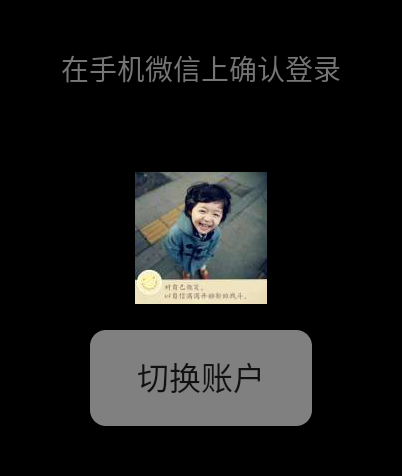
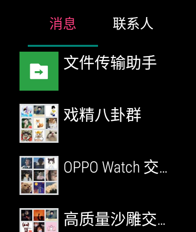
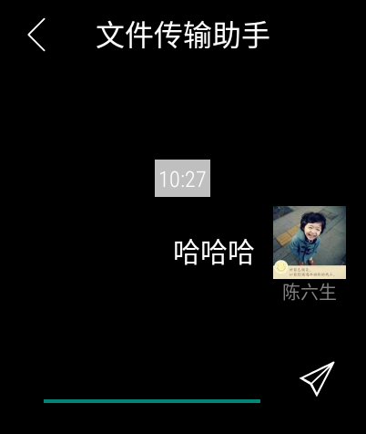

# 微信手表版

## 说明

该微信手表版实际是对网页版微信API的封装集成，只有能登录[微信网页版](https://wx2.qq.com/)的账号才正常使用，可在任何手表上（甚至手机和平板）安装尝试。

欢迎大家继续开发，API说明可查看：[微信网页版接口详解](https://www.cnblogs.com/flashsun/p/8493306.html)，有兴趣可以一起交流QQ:923847753。

## 下载

直接下载：[微信轻聊版.apk](./微信轻聊版.apk)

蓝奏云下载：https://wwr.lanzoui.com/iphkqsk8kne 密码:666

## 界面介绍

扫码登录

手机微信扫码

消息

联系人

聊天界面

